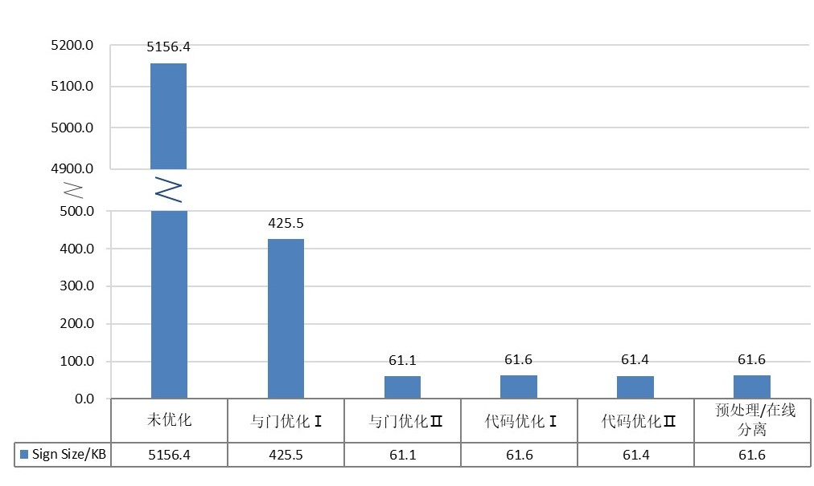
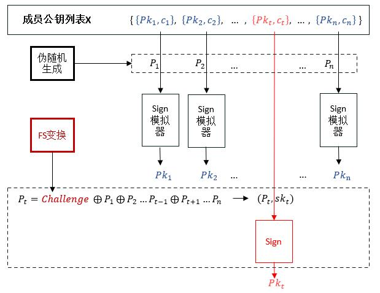
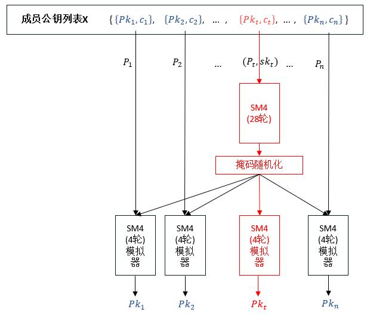
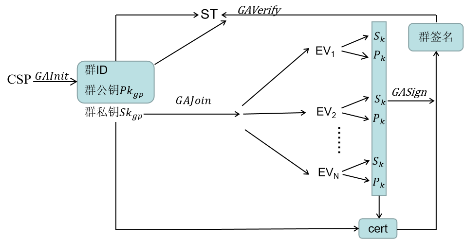
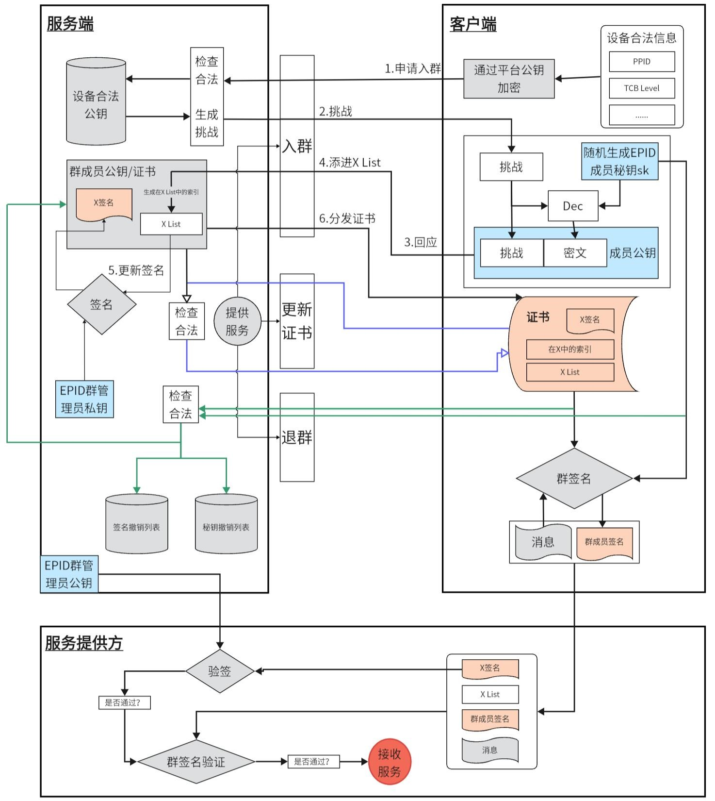
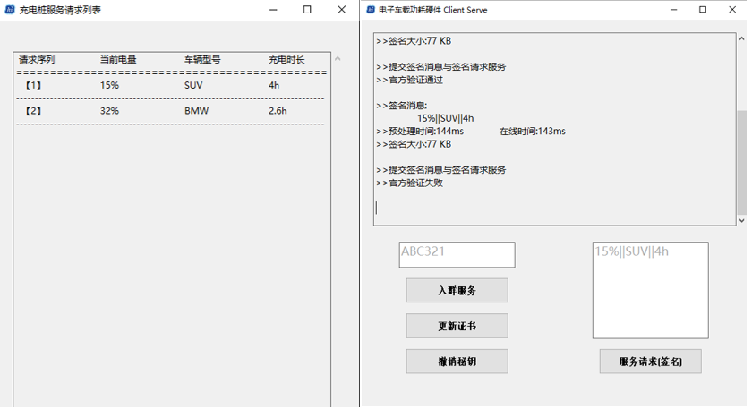

# PQSM4-EPID

## 应用背景

基于后量子隐私增强保护的电动汽车充电认证方案(Post-Quantum SM4 on Enhanced Privacy ID)

随着电动汽车充电设备（EVSE）的技术发展，EVSE需要与云服务、EV及其电池管理系统（BMS）进行通信。其连接的复杂性易导致严重的网络安全问题，目前业界已发生多起通过EVSE远程连接窃取账户凭证或中断充电的网络攻击案例。随着量子计算技术的飞速发展，后量子安全的高效认证协议和隐私保护机制对保证电动汽车充电桩的网络安全尤为迫切。

针对上述问题，我们提出了基于国密标准的后量子签名方案**PQSM4**和后量子隐私增强群签名方案**PQSM4-EPID**，以解决电动汽车充电的认证问题和隐私安全问题，为实现我国电动汽车数据安全的自主可控，提供更加高效可靠的技术保障。

## 我们的工作

为了充分保证电动汽车在认证过程中的匿名性和身份认证性，本作品针对电动汽车充电认证设计了后量子隐私增强方案，作品的主要技术结构与工作内容如下图所示：


### 1. PQSM4签名算法实现

本项目PQSM4使用基于SM4算法的KKW框架实现抗量子签名功能，在同样基于KKW框架的Picnic2方案中以LowMC作为算法原语，由于这LowMC的乘法门个数较少，在执行MPC协议时，产生的通信开销较低。但由于其唯一的非线性部件S盒尚未经过安全性检验，而且现在已经研究出了针对LowMC的攻击算法[[1]](#refer-anchor-1)[[2]](#refer-anchor-2)[[3]](#refer-anchor-3)，其安全性进一步受到挑战。我们将SM4在多方安全计算电路上实现，并对其进行优化，来构造我们的后量子数字签名方案。

#### 1.1 SM4电路优化

为了减少交互和签名长度，降低时空开销，我们应首先优化S盒的与门数量：

我们经过两次算法优化，第一次优化使用贪心算法，对电路表达式中的最大共享因子合并，将每个S盒所需要的与门数量降至246；第二次优化，我们通过复合域变换，将SM4的s盒映射到AES的S盒[[4]](#refer-anchor-4)，利用AES的S盒的电路拆分提取更小的非线性部件电路，将SM4每个S盒数量优化到32，显著地降低了时空开销。具体优化路径如下：

我们把SM4的s盒分成以下三个部分：

$$
S_{sm4}(x) = (M_2B)F(UM_1(x)+UC_1) + M_2T + C_2
$$

- 顶层仿射变换 $UM_1(x)+UC_1$
- 非线性变换 $F$
- 底层仿射变换 $(M_2B)F(x)+M_2T$

我们从s盒中分离出两个仿射变换，剩下的非线性变换F中仅剩 **32个与门** 。

将我们的进行深度优化后多方安全计算电路上的SM4的与门数量与其它常见电路实现进行对比(见表)，可以发现我们优化后的与门数量少于目前大多数的电路实现方案。

<center>

|  方案     |          AND      |   XOR/XNOR   |
| :--------:| :-----------: | :------------------------: |
|  Mart[[5]](#refer-anchor-5)     |  58                    |  99  |
| Bai[[6]](#refer-anchor-6)  |  63       |  157                   |
| Abbasi[[7]](#refer-anchor-7)  |  36       |  134                   |
|     **ours**   |  **32**  |  **81**               |

</center>

#### 1.2 Feistel结构掩码数量优化

为了实现国密化的签名方案，本作品使用零知识证明友好的对称原语SM4。由于加密为非对称的Feistel结构，需要使用更多掩码来掩盖每一轮加密后的中间值。考虑到用于加密的明文由各方共享，不需要设置均匀随机的掩码，我们使用掩码混合技术，设置各方明文的初始掩码均为0，以此来降低各方需要共享的消息值。

#### 1.3 PQSM4代码实现与优化

<center>

|  SM4电路优化与多线程加速                           |  Sign size(B)  |  Sign Time(ms) |  Vrfy Time(ms)  |
| :---------------------------------------: | :---------------------: | :----------------------: | :----------------------: |
|  SM4 246AND GATE                  |  435756             |  12881.00            |  7708.00             |
|  SM4 32AND GATE                   |  62524              |  2114.00             |  1141.00             |
|  SM4 32AND GATE WITH 20  THREADS  |  63108              |  546.38              |  220.26              |

</center>

##### PQSM4签名长度优化(单位KB)：

> 

##### PQSM4签名时间优化(单位ms)：

> 

##### PQSM4验证时间优化(单位ms)：

> 


### 2. PQSM4-EPID框架设计优化及代码实现

本作品设计在遵循Dan Boneh等人在[[8]](#refer-anchor-8)中提出的EPID抗量子理论框架的前提下做出了许多改进。

#### 2.1 抗量子签名算法模型设计

我们将自主设计的基于SM4的后量子签名算法PQSM4作为本作品的签名算法原语。

#### 2.2 成员存在性证明优化

我们弃用了原方案中基于Merkle静态累加器结构的成员证明器AC，替换为基于CDS的One-Out-of-N-Proof的成员证明方案。

在Dan Boneh在 [[8]](#refer-anchor-8)的construction 9的EPID架构中，由于Merkle树结构的累加器为静态累加器，群成员将其证书作为Merkle树中的叶子来实现构建Merkle树。然而每有一个成员加入时都需要发布一个新的Merkle根，这减少了匿名集的大小。故而在Dan Boneh的EPID架构中还需要一个的协议函数使群成员定期“重新加入群组”中更新他们的Merkle根，从而增加匿名集的大小。

我们的方案应用了我们自主设计的基于SM4的后量子签名算法PQSM4来构建基于One-Out-of-N-Proof的累加器方案，在具体实例化中，由于该模式下的累加器为线性表的结构，且累加器内的所有成员证书被直接作为成员证明的输出，故而只需要群成员自主更新官方维护的成员承诺列表(累加器)即可。节省了服务端的交互成本。

##### One-Out-of-N-Proof结构图：

> 

其次，由于公钥的合法性直接由官方维护的累加器中可以得知（累加器可以动态删减不合法的成员），故而在所有的验证环节中，对于KeyRL的检查可以删去。减少了验证成本和交互成本。

基于优化后的动态累加器结构，我们删去了原框架中的ReJoin函数，并删去了Verify协议中对撤销秘钥列表KeyRL的检验步骤。

#### 2.3 签名验证时空优化

我们通过对SM4使用Resumable HVZK Pok的技术优化了Proof大小[[9]](#refer-anchor-9)。通过对SM4可提取轮数的研究，成功将PQSM4签名模拟器的电路轮数由32轮降低至4轮，具体原理如下图：

##### Resumable HVZK Pok结构图：

> 

相较于Dan Boneh等人提出的原EPID框架，本作品更加适用于小范围的物联网应用场景。在同样的密码学原语基础上，我们的方案具有相对更短的证明大小和验证时间、更加简洁的交互过程和更强的成员隐私性。

#### PQSM4-EPID签名长度与成员大小关系(单位KB)：

> 

#### PQSM4-EPID签名时间与成员大小关系(单位ms)：

> 

#### PQSM4-EPID验证时间与成员大小关系(单位ms)：

> 


### 3. 充电桩认证交互协议框架和代码实现

#### 3.1 协议框架

将构建的后量子隐私增强方案应用于电动汽车充电过程中的匿名认证系统中，方案不仅能对电动汽车安全有效的认证，也能确保电网安全，保证仅向授权的车辆提供充电服务，对非授权的电动汽车或电池管理系统拒绝服务，流程如下：

电动汽车在请求充电服务时，首先生成充电请求，发送给充电站，充电站检查本地是否存有该车所在的群和群公钥，若没有，向充电服务提供商请求这些信息，获取对应群和群公钥后，充电站对不会暴露任何车身份的情况下电动汽车的身份进行验证，通过充电站的验证后，电动汽车将自己的充电请求消息用临时会话密钥加密后发送给充电站，获取充电服务。

#### 协议框架：

> 

#### 认证方案运行模式:

> 


#### 3.2 网络传输框架

我们通过c++的winSock2.h库实现网络信息传输功能，使用EasyX库构建ui交互界面。下图为TCP框架设计图：

#### TCP框架:

> 


下图为ui展示：

> 

### 4. 代码说明

下列列出文件为`./code`下的源代码文件，其生成的可执行文件存放于`./可执行文件`目录下。若需要检查运行源码，需先运行**EasyX_20220901.exe**安装相关环境。

**EPIDCilent**：充电认证客户端与ui设计

> 双击`./code/EPIDCilent/EPID.sln`运行源码

> 在Realease模式下运行！

> 生成客户端exe可执行文件保存于`.\EPIDCilent\x64\Release`

**EPIDServer**:充电认证服务端与ui设计

> 双击`./code/EPIDServer/EPID.sln`运行源码

> 在Debug模式下运行！

> 生成客户端exe可执行文件保存于`.\EPIDServer\x64\Debug`

```
注意1

若需要关闭客户端服务端运行时的cmd命令窗口，可进行如下操作： 
server.cpp(16行)修改#define SHOWCONSOLES 0
cilent.cpp(20行)修改#define SHOWCONSOLES 0
若需要重新开启cmd命令窗口显示，修改为1即可。

注意2

由于群签名中为线性表管理，仅1人时无法进行群签名，需要运行两个以上客户端
可执行文件。
```

**EPIDLib**:EPID协议框架相关函数，生成EPID.lib文件

**Picnic-master**:PQSM4-EPID与PQSM4算法相关函数，生成libpicnic.lib

**EasyX_20220901.exe**：ui环境

## 引用

<div id="refer-anchor-1"></div>

###### [1] Cryptanalysis of Full LowMC and LowMC-M with Algebraic Techniques

<div id="refer-anchor-2"></div>

###### [2] Fukang Liu, Gaoli Wang, Willi Meier, Santanu Sarkar, Takanori Isobe:

<div id="refer-anchor-3"></div>

###### [3] Algebraic Meet-in-the-Middle Attack on LowMC. IACR Cryptol. ePrint Arch. 2022: 19

<div id="refer-anchor-4"></div>

###### [4] 刘景美,赵林森,王静,王新梅.确定RijndaelS盒布尔函数的等价方法[J].华中科技大学学报(自然科学版),2010,38(01):58-60.DOI:10.13245/j.hust.2010.01.023.

<div id="refer-anchor-5"></div>

###### [5] Mart ´ ınez-Herrera, A.F., Mex-Perera, J.C., Nolazco-Flores, J.A.: Mergingthe Camellia,SMS4 and AES S-Boxes in a single S-Box with composite bases. In:Information Security,16th International Conference, ISC 2013, Dallas, Texas,USA, November 13-15, 2013,Proceedings, pp. 209–217 (2013)

<div id="refer-anchor-6"></div>

###### [6] Bai, X., Xu, Y., Guo, L.:Securing SMS4 cipher against differential power analysis and itsVLSIimplementation. In: IEEE Singapore International Conference onCommunicationSystems, pp. 167–172 (2009)

<div id="refer-anchor-7"></div>

###### [7] Abbasi, I., Afzal, M.: Acompact S-Box design for SMS4 block cipher. IACR CryptologyePrint Archive 2011,522 (2011)

<div id="refer-anchor-8"></div>

###### [8] Dan B ,  Eskandarian S , Fisch B .post-quantum epid group signatures from symmetric primitives[J]. 2019.

<div id="refer-anchor-9"></div>

###### [9] Zhang H, Wei P, Xue H, et al. Resumable zero-knowledge for circuits from symmetric key primitives[C]//Information Security and Privacy: 27th Australasian Conference, ACISP 2022, Wollongong, NSW, Australia, November 28–30, 2022, Proceedings. Cham: Springer International Publishing, 2022: 375-398.
